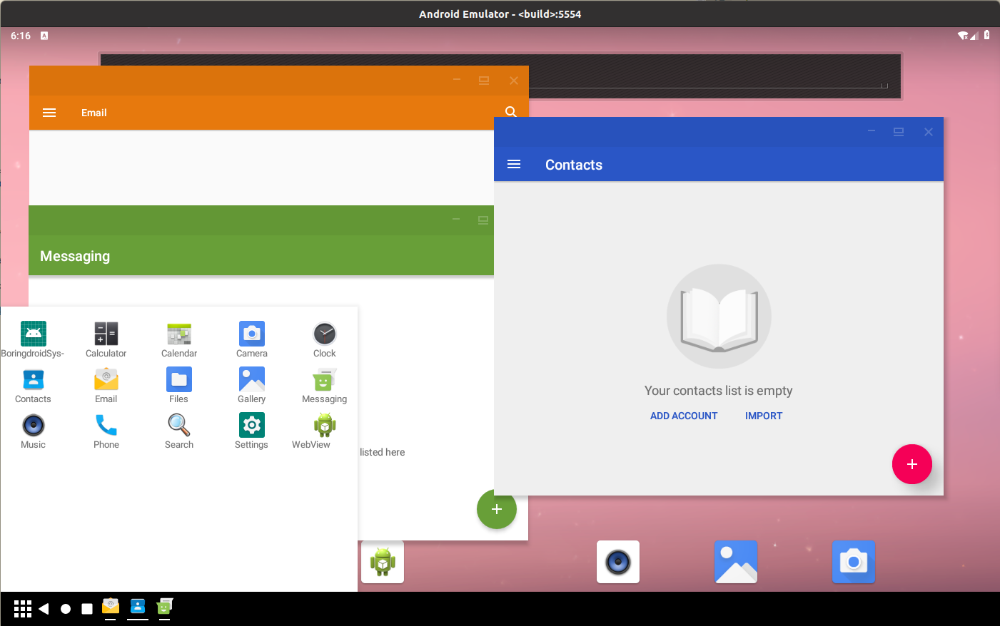

# boringdroid


## Introduction

Boringdroid is an `AOSP` extending project based on `AOSP`(9.0 - 11.0), and it provides a minimum patchset to use multi-window in `AOSP` by default. The patch set is boring, and most of problems the patchset resolves look like they are disappearing on `master` branch, so the project is boring, that the reason I calls it Boringdroid.

## Preview



The boringdroid adds a minimize button for each window, and provides a smooth resizing experience. Boringdroid also provides an enhanced taskbar to show running task list and installed app list. The next steps for Boringdroid will be to provide system tray functionalities in the taskbar.

## Download

```shell
mkdir -p boringdroid/11
cd boringdroid/11
repo init -u https://github.com/boringdroid/manifest.git -b boringdroid-14.0.0
repo sync -c -d --no-tags
```
## Build

```shell
source build/envsetup.sh
lunch boringdroid_x86_64-userdebug
m
```

The boringdroid now runs in emulator, which is convenient to debug and test modification. So the product `boringdroid_x86_64` bases on the `goldfish`. After building, we can execute `emulator` to start emulator.

From boringdroid-13.0.0, if you encounter boot image verified error, you can try use `m -j8` or other proper thread number to reduce the thread number for building to fix it.

## Contributing

See [CONTRIBUTING](CONTRIBUTING.md)

## Architecture

See [ARCHITECTURE](ARCHITECTURE.md)

## Android-x86 porting

The [Android-x86](https://www.android-x86.org/) has accepted ported patches for [Android-x86](https://www.android-x86.org/) to their code repositories.

## A BlissLabs Project

The boringdroid is a [BlissLabs](https://blisslabs.org/) Project.

## Special thanks

Thanks Roger Truttmann of [BlissLabs](https://blissos.org/) to help design logo.

## License

The modified `AOSP` project uses the origin license. And the `boringdroid` created projects will uses its custom license on its project.
