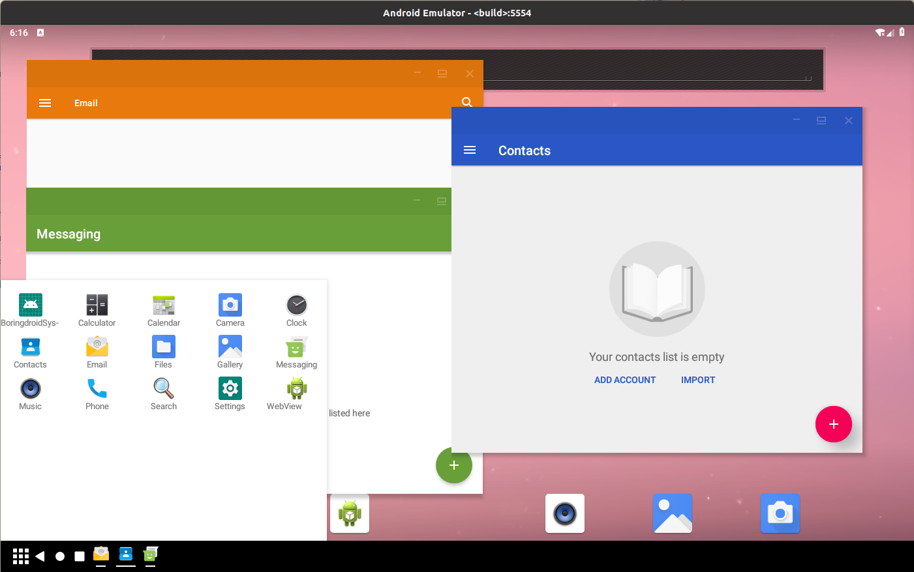

# boringdroid


## Introduction

Boringdroid is an AOSP-extending project that layers a minimal multi-window
patchset on top of stock Android. It tracks AOSP 9.0 through 14.0; this
branch is `boringdroid-14.0.0`. The patches are intentionally small,
conservative, and almost-upstream-quality. A lot of the rough edges the
patchset originally papered over have been smoothed out by AOSP itself in
later releases, which is the point.

## Preview



Freeform windows ship enabled by default, with bounds and windowing-mode
persistence so apps come back where you left them. The plugin-driven taskbar
shows running tasks and installed apps, an action center with notifications
and quick-settings tiles, a calendar / clock panel, a start menu, and an
Overview surface for Alt+Tab / recents. A separate Settings app exposes the
PC-mode toggles via Android's stock Settings dashboard.

## Download

```shell
mkdir -p boringdroid/14
cd boringdroid/14
repo init -u https://github.com/boringdroid/manifest.git -b boringdroid-14.0.0
repo sync -c -d --no-tags
```

## Build

```shell
source build/envsetup.sh
lunch boringdroid_x86_64-userdebug
m
```

The default product is `boringdroid_x86_64`, derived from `sdk_phone_x86_64`,
so the resulting image runs in the AOSP emulator. After `m` finishes, launch
it with `emulator`.

From `boringdroid-13.0.0` onward, if the build fails with a "boot image
verified" error, retry with a smaller `-j` value (e.g. `m -j8`). The
underlying race is upstream; the lower parallelism is a workaround.

## Contributing

See [CONTRIBUTING](CONTRIBUTING.md).

## Architecture

See [ARCHITECTURE](ARCHITECTURE.md).

## Android-x86 porting

The [Android-x86](https://www.android-x86.org/) project has accepted ported
patches from boringdroid into its repositories.

## A BlissLabs project

Boringdroid is a [BlissLabs](https://blisslabs.org/) project.

## Special thanks

Thanks to Roger Truttmann of [BlissLabs](https://blissos.org/) for the logo.

## License

Modifications to AOSP files inherit the upstream Apache 2.0 license.
Boringdroid-owned projects ship under their own LICENSE file.
