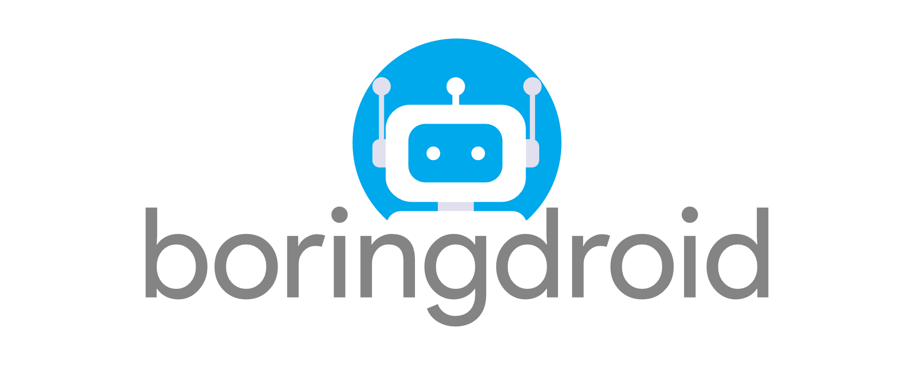
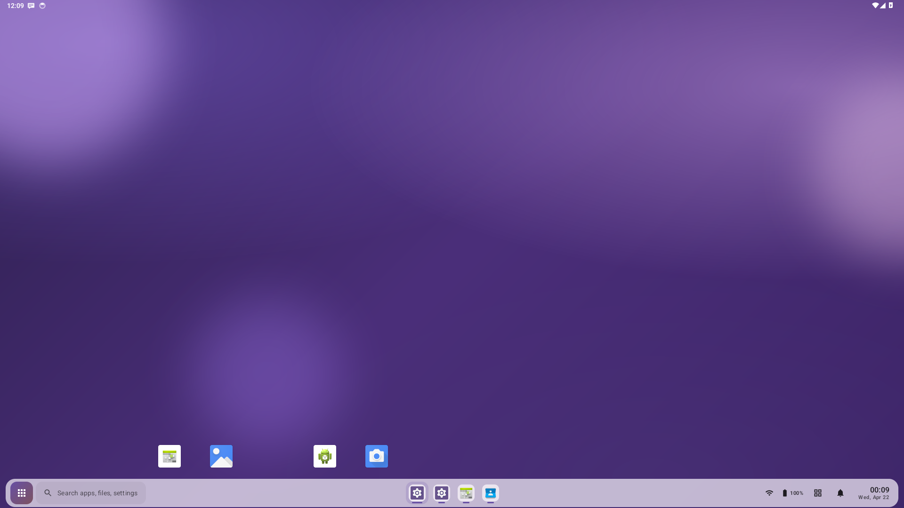
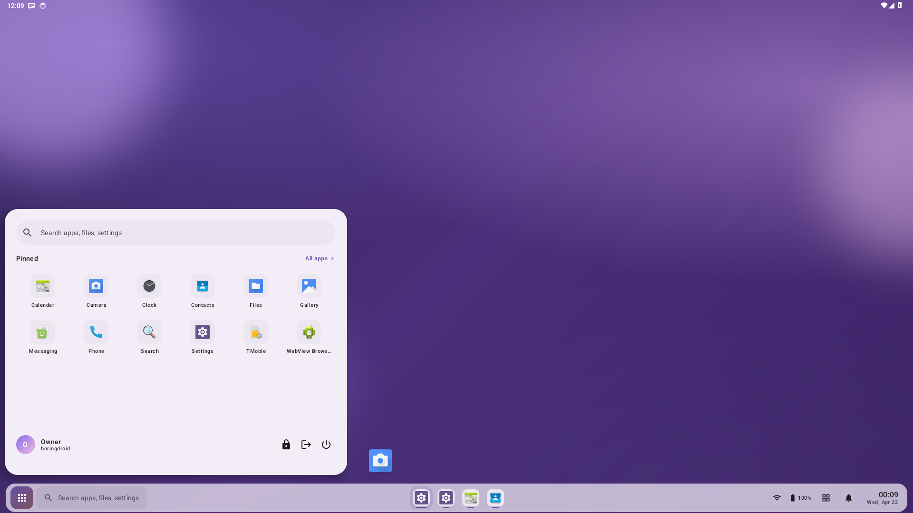
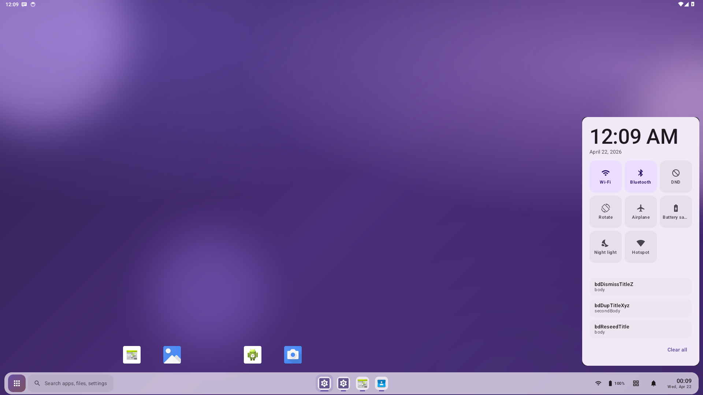
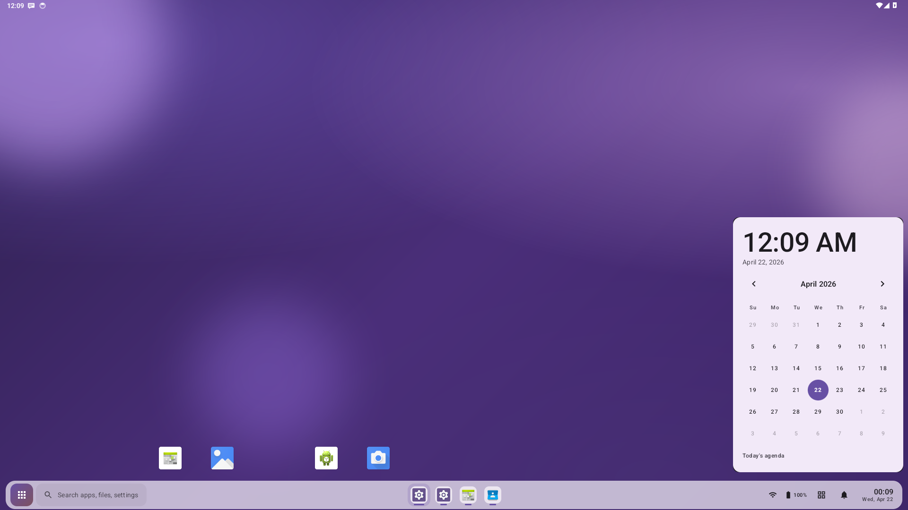
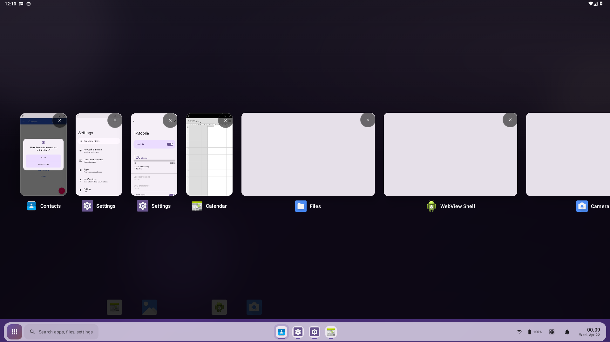
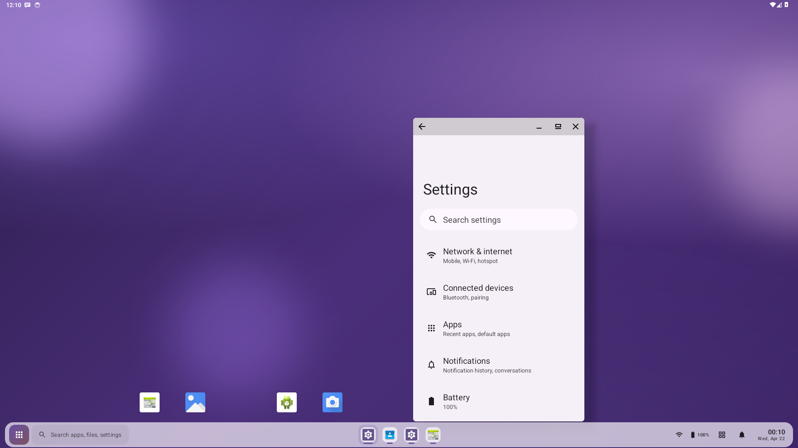
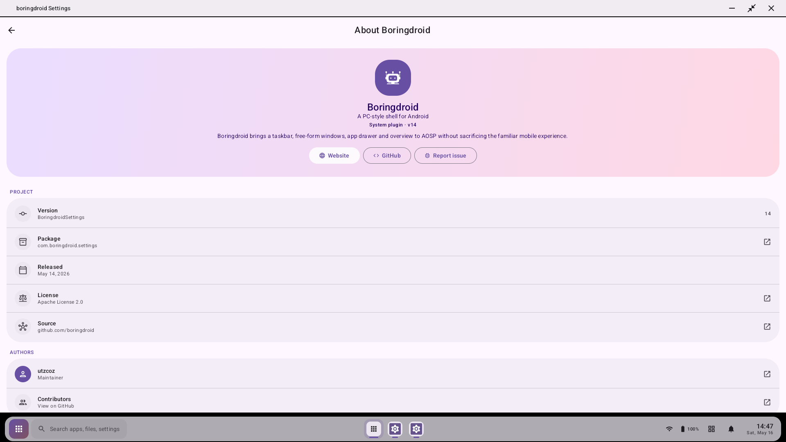

# boringdroid



## Introduction

Boringdroid is an AOSP-extending project that layers a minimal multi-window
patchset on top of stock Android. It tracks AOSP 9.0 through 14.0; this
branch is `boringdroid-14.0.0`. The patches are intentionally small,
conservative, and almost-upstream-quality. A lot of the rough edges the
patchset originally papered over have been smoothed out by AOSP itself in
later releases, which is the point.

## Preview

### Home



Home screen on the `boringdroid_x86_64-userdebug` emulator: the purple
default wallpaper, Launcher's hotseat sitting above the taskbar, and the
boringdroid taskbar pinned at the bottom with a start pill, search pill,
centered running-app rail, and the system tray.

### Start menu



Compose-built start menu with a search pill, a pinned-app grid, and a user
rail (lock, sign-out, power). Opens from the start button, the search pill,
or the Meta key.

### Action Center



Clock header, a 3×3 grid of named quick-settings tiles (Wi-Fi, Bluetooth,
DND, Rotate, Airplane, Battery saver, Night light, Hotspot), a now-playing
media card, the notification list, and a Clear all action. Opens on the
taskbar bell.

### Calendar & Clock



42-day month grid with next/previous navigation, event dots pulled from
`CalendarContract.Instances`, and today's agenda below. Opens on the taskbar
clock; opening it closes the Action Center.

### Recents



Mission-Control-style expo. Each card is sized to its real window bounds
under a common scale, so portrait popups read as portrait and landscape
freeform windows read as landscape. Tapping a thumbnail or its caption
brings the task back to the front. Triggered from the taskbar or Alt+Tab.

### Freeform multi-window



`config_freeformWindowManagement=true` ships by default. Apps open in
resizable freeform windows with minimize / maximize / close in the title
bar, and the framework persists each app's bounds and windowing mode across
sessions.

### Peek caption



When a freeform window is maximized to fullscreen, the title bar is gone
but the minimize / restore / close controls are still one cursor move
away: park the pointer at the top edge of the screen and a slim caption
slides down. Move away and it tucks back. Closes
[issue #1](https://github.com/boringdroid/boringdroid/issues/1). Gated by
`persist.boringdroid.peek_caption` (default on), and only arms when
WMShell is running the legacy caption — modern desktop-mode caption
(`persist.wm.debug.desktop_mode` / `_2`) keeps its own in-window caption
visible after maximize, so peek skips arming to avoid duplication.

### Taskbar context menu

Right-click any running-app icon in the taskbar and you get a small
popup with **Maximize/Restore**, **Minimize**, and **Close** — the
same three actions a window caption offers, anchored at the icon
rather than the window. Useful for windows pushed off-screen, hidden
behind others, or simply when your cursor is closer to the taskbar
than the title bar.

## Download

```shell
mkdir -p boringdroid/14
cd boringdroid/14
repo init -u https://github.com/boringdroid/manifest.git -b boringdroid-14.0.0
repo sync -c -d --no-tags
```

## Build

```shell
source build/envsetup.sh
lunch boringdroid_x86_64-userdebug
m
```

The default product is `boringdroid_x86_64`, derived from `sdk_phone_x86_64`,
so the resulting image runs in the AOSP emulator. After `m` finishes, launch
it with `emulator`.

From `boringdroid-13.0.0` onward, if the build fails with a "boot image
verified" error, retry with a smaller `-j` value (e.g. `m -j8`). The
underlying race is upstream; the lower parallelism is a workaround.

## Samples

The [`samples/HelloBoringdroid`](https://github.com/boringdroid/sample_HelloBoringdroid)
module is an all-in-one Compose demo that exercises every distinctive
boringdroid surface in a single APK: freeform window with a draggable
caption, peek caption when maximized, taskbar context menu on long-press,
a `<monochrome>` adaptive-icon layer for Material You themed icons, and
a Material 3 body that pulls `dynamicLight/DarkColorScheme(context)`
from the wallpaper on Android 12+. It doubles as a smoke-test target —
launch it, drive each surface manually, watch logcat.

Build and install with:

```shell
source build/envsetup.sh
lunch boringdroid_x86_64-userdebug
m HelloBoringdroid
adb install -r out/target/product/boringdroid_x86_64/system/app/HelloBoringdroid/HelloBoringdroid.apk
```

The sample is a Soong module (`sdk_version: "current"`) — no Gradle, no
`platform_apis`, so it stays consumable by anyone forking boringdroid.
Source code, layout details, and a per-surface verification recipe live
in [`samples/HelloBoringdroid/README.md`](samples/HelloBoringdroid/README.md).

## Contributing

See [CONTRIBUTING](CONTRIBUTING.md).

## Architecture

See [ARCHITECTURE](ARCHITECTURE.md).

## Android-x86 porting

The [Android-x86](https://www.android-x86.org/) project has accepted ported
patches from boringdroid into its repositories.

## A BlissLabs project

Boringdroid is a [BlissLabs](https://blisslabs.org/) project.

## Special thanks

Thanks to Roger Truttmann of [BlissLabs](https://blissos.org/) for the logo.

## License

Modifications to AOSP files inherit the upstream Apache 2.0 license.
Boringdroid-owned projects ship under their own LICENSE file.
