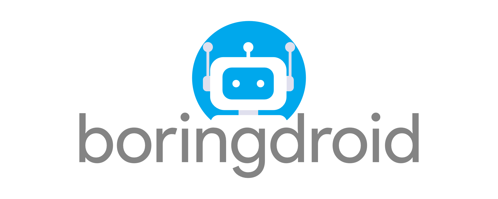

# boringdroid



## Introduction

Boringdroid is an `AOSP` extending project based on `AOSP`(9.0 - 11.0), and it provides a minimum patchset to use multi-window in `AOSP` by default. The patch set is boring, and most of problems the patchset resolves look like they are disappearing on `master` branch, so the project is boring, that the reason I calls it Boringdroid.

## Preview


The boringdroid adds a minimize button for each window, and provides a smooth resizing experience. Boringdroid also provides an enhanced taskbar to show running task list and installed app list. The next steps for Boringdroid will be to provide system tray functionalities in the taskbar.

## Download

```shell
mkdir -p boringdroid/11
cd boringdroid/11
repo init -u https://github.com/boringdroid/manifest.git -b boringdroid-11.0.0
repo sync -c -d --no-tags
```
## Build

```shell
source build/envsetup.sh
lunch boringdroid_x86_64-userdebug
m
```

The boringdroid now runs in emulator, which is convenient to debug and test modification. So the product `boringdroid_x86_64` bases on the `goldfish`. After building, we can execute `emulator` to start emulator.

## BoringdroidSystemUI

The `BoringdroidSystemUI` uses the `SystemUI`'s plugin hook library to add custom views to system navigation bar. And it also uses `sysui_shared.jar` exposed by `SystemUI` to receive task changed events for taskbar. For better developing experience, it provides a gradle script to develop the `BoringdroidSystemUI` in latest `AndroidStudio`. For more detail, please see the document in the project [BoringdroidSystemUI](https://github.com/boringdroid/vendor_packages_apps_BoringdroidSystemUI).

If you have interested on `BoringdroidSystemUI`, and don't want to download full source code, maybe you can try [emulator-images-release](https://github.com/boringdroid/emulator-images-release), and use emulator from Android Studio to run it. It only supports boringdroid 10 now, and we will support boringdroid 9 if there are users have interested on it. So if you it to develop `BoringdroidSystemUI`, please change branch to [`boringdroid-10.0.0`](https://github.com/boringdroid/vendor_packages_apps_BoringdroidSystemUI/tree/boringdroid-10.0.0).

## Android-x86 porting

The [Android-x86](https://www.android-x86.org/) has accepting ported patches for [Android-x86](https://www.android-x86.org/) to their code repositories.

## Bliss Family Projects

The boringdroid is the part of [Bliss Family Projects](https://blissos.org/).

## Special thanks

Thanks Roger Truttmann of [Team Bliss](https://blissos.org/) to help design logo.

## License

The modified `AOSP` project uses the origin license. And the `boringdroid` created projects will uses its custom license on its project.
